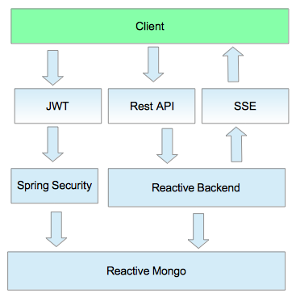

#### Install Dependencies
* [Maven](https://maven.apache.org/)

## Design



## Development:


### DB
Run a mongo instance:
```
  docker run --name timezone  -p 27017:27017  -d mongo
```

Create the database initial data:
```
  mongo < ./data/init.js
```


## Setup

### Server
To run the program from command line:
```
  mvn spring-boot:run
```

### Frontend
```
  cd frontend
  webpack-dev-server --inline --hot
```

Open in browser:

[http://locahost:8081](http://locahost:8081)


### API Client

There is a Postman collection available at: /docs/postman

Call the streams:
```
    curl localhost:8080/api/v1/streams/timezones -v -H "Accept: text/event-stream" -H "Authorization: Bearer {{token}}"
```

### Testing
To run the tests from command line:
```
  mvn test
```
